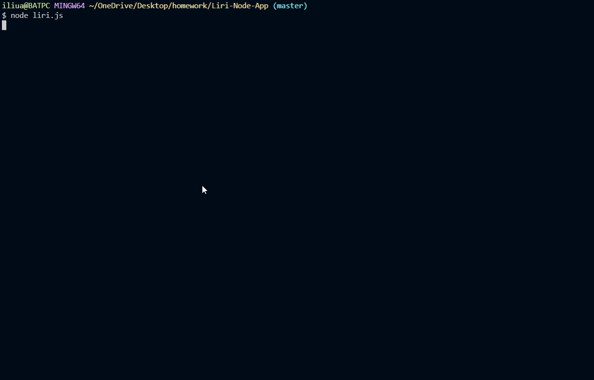

# Liri-Node-App

## About 
LIRI is a Language Interpretation and Recognition Interface. It takes in 4 commands: concert-this, spotify-this-song, movie-this, and do-what-it-says.
After the user selects a command (i.e, movie-this) and passes information (Harry Potter), Liri will return some more details about a Harry Potter movie, such as the ratings, plot summary, actors, and year released. 

##  Technology Used
- Javascript
- Node.js
- NPM

NPM Packages | :
------------ | -------------
[axios npm](https://www.npmjs.com/package/axios) | [moment npm](http://momentjs.com/docs/)
[inquirer npm](https://www.npmjs.com/package/inquirer) | [node-spotify-api](https://www.npmjs.com/package/node-spotify-api)
[dotenv](https://www.npmjs.com/package/dotenv) | [chalk](https://www.npmjs.com/package/chalk)

## Author 
Adrienne Liu

### Acknowledgements
Minal Kharche  
Joanne Badua 